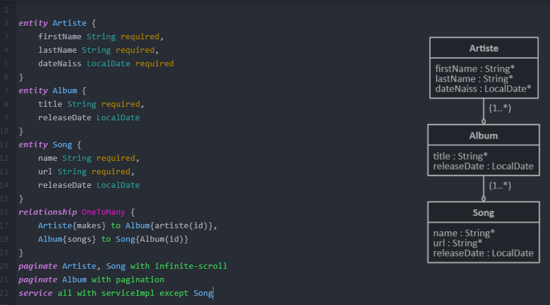
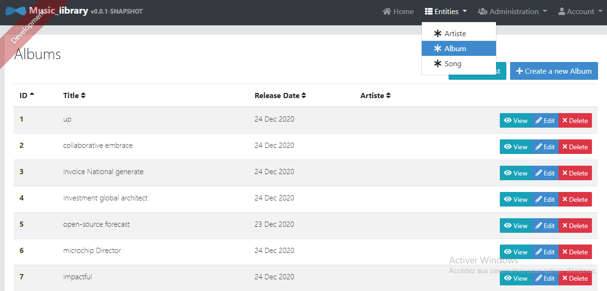
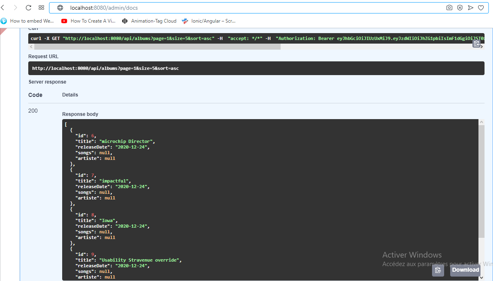

## Simple music library using Jhipster
we used Jhipster to generate a monolith spring cloud/angular project of a simple music library
### Class diagram
we used [JLD-Studio](https://start.jhipster.tech/jdl-studio/ "JLD-Studio") (online) to generate and visualise the class diagram of the project:
https://start.jhipster.tech/jdl-studio/
<p style="text-align: center;">
  
</p>


### Generating entities with Jhipster
After generating the blank project we wanted to generate classes.
So First we must download the .jdl file from [JLD-Studio](https://start.jhipster.tech/jdl-studio/ "JLD-Studio"). You can find the downloaded file in the code as text or in the image shown above.
And then run the following command in the bash (command-line):
````bash
jhipster import-jdl ./jhipster-jdl.jdl --force
````
### Results

<p style="text-align: center;">
  
</p>

<p style="text-align: center;">
  
</p>
### Authors:
- TRICHI Oussema
- RHIBI Hamdi


